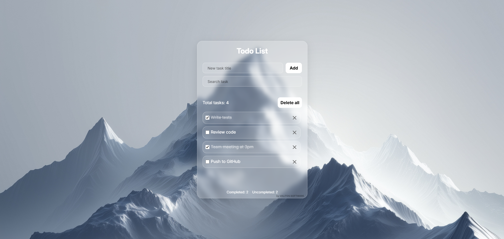

# **Glassmorphism Todo List**

This is my first project where I’m practicing core Web Development skills. The main goal was to implement a modern Glassmorphism design using pure HTML and CSS, focusing on clean layout and responsiveness.

## Tech Stack

1) HTML5;
2) CSS3;
3) JS.

## Progress

- [x] Clean semantic HTML code (HTML).
- [x] Implemented frosted glass effect using backdrop-filter (CSS).
- [x] Responsive on mobile version (CSS)
- [x] Hover/active effects and animated floating labels (CSS). 
- [x] DOM manipulation for adding tasks (JS)
- [x] DOM manipulation for deleting all tasks (JS).
- [x] Add localStorage (JS)
- [x] Add task submission on Enter (JS)
- [x] DOM manipulation for deleting tasks (JS).
- [x] Real-time filtering system (Input search) (JS).
- [x] Added XSS protection (JS).

